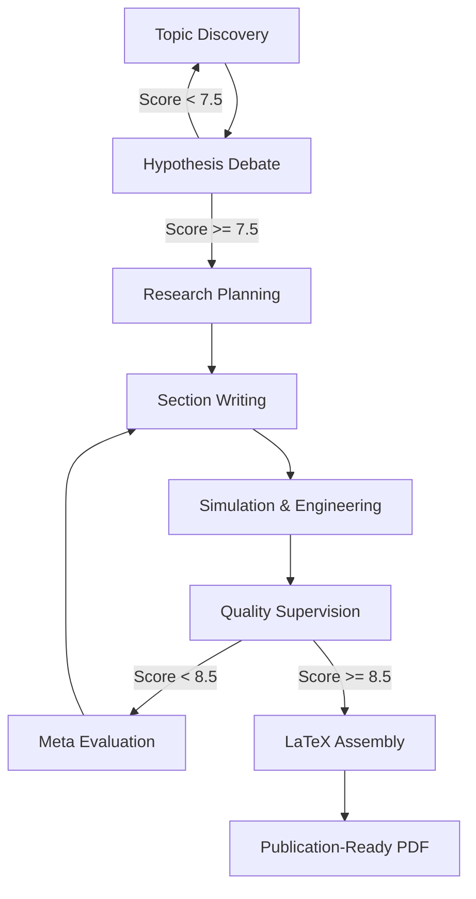

# ScholarGraph — Autonomous Multi-Agent Research Engine

  
  
  
  
  

A hobby project — and one I'm genuinely proud of. ScholarGraph is a fully autonomous multi-agent AI system that takes a research domain as input and outputs a publication-ready LaTeX paper. No human in the loop. Eight specialized agents collaborate, debate, write, run code, validate quality, and assemble the final document from scratch.

---

## 🚀 How It Works

The system runs as a state-managed pipeline built on LangGraph, where agents hand off work, loop back on failures, and enforce quality gates before proceeding.

### 1. Topic Discovery
The **Topic Hunter Agent** scans academic databases to find research gaps — areas with rising citation trends but no strong existing solutions.
- Sources: OpenAlex, arXiv, CrossRef
- Output: Ranked list of feasible, high-impact research topics

### 2. Hypothesis Debate
Before any writing begins, the selected topic goes through an adversarial debate between three agents:
- **Proposer** — builds the theoretical case for the hypothesis
- **Challenger** — identifies flaws, feasibility issues, and ethical concerns
- **Moderator** — scores the debate 1–10. Below 7.5, the topic is rejected and the pipeline restarts

### 3. Research Planning
The **Planner Agent** designs the full paper structure — sections, experiment dependencies, research questions, and expected contributions — stored in a FAISS vector database for agents to reference throughout the pipeline.

### 4. Writing & Engineering
- **Writer Agent** drafts each section with academic tone and integrated citations
- **Engineer Agent** generates and *actually executes* Python code to run simulations, compute metrics (Accuracy, F1, etc.), and produce Matplotlib visualizations embedded directly in the paper

### 5. Quality Control & Iteration
The **Supervisor Agent** checks every section for:
- Hallucinations
- Mathematical validity (via SymPy)
- Code correctness
- Peer review simulation

Sections scoring below **8.5/10** are sent back. The **Meta Agent** monitors the full system — detecting stuck loops, triggering topic shifts, and ensuring the pipeline doesn't spiral.

### 6. Final Assembly
The **Editor Agent** converts all drafts into structured LaTeX, manages the bibliography, and compiles the final publication-ready PDF.

---

## 🧠 Agent Architecture

| Agent | File | Role |
|---|---|---|
| Topic Hunter | `topic_hunter.py` | Literature mining, gap identification |
| Proposer | `hypothesis_debate.py` | Builds case for the research hypothesis |
| Challenger | `hypothesis_debate.py` | Adversarial review — finds flaws |
| Moderator | `hypothesis_debate.py` | Scores debate, decides pass/fail |
| Planner | `planner.py` | Designs research roadmap and dependencies |
| Writer | `writer.py` | Drafts academic sections with citations |
| Engineer | `engineer.py` | Generates and executes simulation code |
| Supervisor | `supervisor.py` | Multi-layer quality assurance and scoring |
| Meta Agent | `meta_agent.py` | System oversight, loop detection, resets |
| Editor | `editor.py` | LaTeX assembly and PDF compilation |

---

## 🔄 Pipeline Flow

---

## 🛠️ Tech Stack

| Layer | Technology |
|---|---|
| Orchestration | LangGraph — state-managed directed acyclic graphs |
| LLM | Google Gemini 2.5 Flash Lite & Gemini Pro |
| Memory | FAISS vector index — persistent knowledge across agents |
| Academic APIs | arXiv, OpenAlex, CrossRef, scite |
| Engineering | NumPy, Pandas, Matplotlib, Scikit-Learn |
| Document Engine | PyLaTeX, SymPy, Jinja2 |

---

## 📂 Output Files

| File | Description |
|---|---|
| `paper_output.pdf` | Final compiled paper |
| `paper_output.tex` | LaTeX source |
| `plan.yaml` | Full research roadmap |
| `feedback_log.json` | Quality scores per section |
| `debate_log.txt` | Full hypothesis debate transcript |
| `draft_versions/` | Iteration history |

---

## 💡 Skills This Project Demonstrates

- Multi-agent system design with LangGraph — state machines, conditional edges, feedback loops
- LLM orchestration across 8+ specialized agents with distinct roles and tool access
- Adversarial agent patterns — debate systems with scoring and hard rejection gates
- Retrieval-augmented generation using FAISS vector memory
- Code-executing agents — not just generating code but running it and feeding results back into the pipeline
- Academic API integration (arXiv, OpenAlex, CrossRef)
- Quality enforcement architecture — multi-layer validation before any output proceeds
- LaTeX document generation and PDF compilation from LLM output

---

## 📫 Contact

Open to freelance projects and remote opportunities — especially AI systems, automation pipelines, and backend development.

- **GitHub:** [github.com/abubakaramin](https://github.com/abubakaramin)
- **Email:** [abubakarmain100@gmail.com](mailto:abubakarmain100@gmail.com)