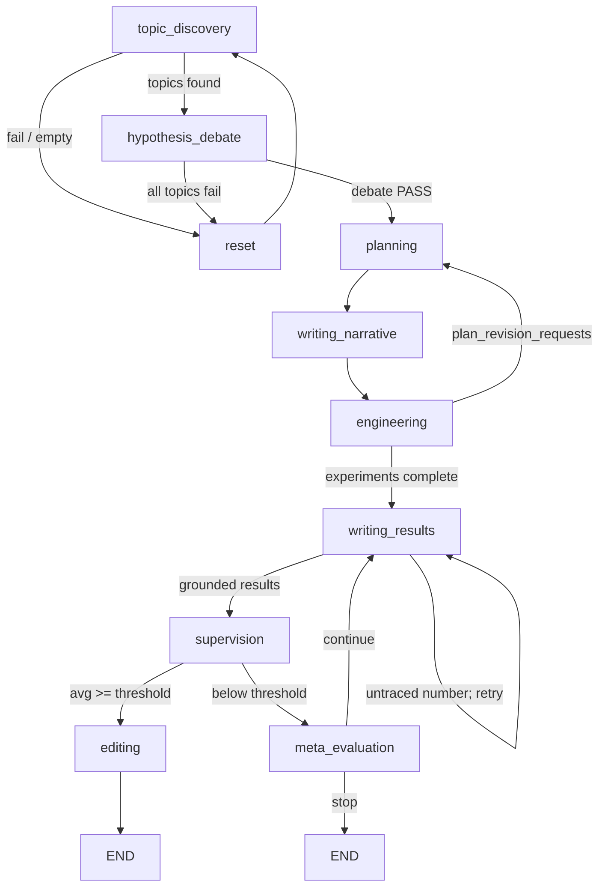

# ScholarGraph — Research-Grade Autonomous Multi-Agent Research System

<p align="left">
  
  
  
  
  
  
</p>

ScholarGraph is an autonomous multi-agent research pipeline. Given a research domain, it discovers gaps, adversarially debates hypotheses, designs falsifiable experiments, executes sandboxed code with multi-seed statistics, verifies citations and reported numbers against raw data, and assembles a LaTeX paper plus a companion code repo.

For module-by-module architecture notes and the staged refactor plan, see [docs/README.md](docs/README.md).

**Design thesis:** quality comes from the harness, not from hoping a single LLM call is brilliant. Soft “vibe scores” are secondary; hard, checkable verification (resolved DOIs, recomputed stats, sandbox lockdown, PIVOT/REFINE) is primary — aligned with failure modes documented in systems like AI Scientist v1/v2, Agent Laboratory, AgentRxiv, and AutoResearchClaw.

---

## Table of contents

1. [Quick start](#quick-start)
2. [Architecture overview](#architecture-overview)
3. [System intent and quality contract](#system-intent-and-quality-contract)
4. [Pipeline graph (exact edges)](#pipeline-graph-exact-edges)
5. [Persistence and data model](#persistence-and-data-model)
6. [State schema](#state-schema)
7. [Core modules (technical spec)](#core-modules-technical-spec)
8. [Agents (technical spec)](#agents-technical-spec)
9. [Verification & quality gates](#verification--quality-gates)
10. [LLM provider layer](#llm-provider-layer)
11. [Web UI — Control Deck](#web-ui--control-deck)
12. [Configuration & environment](#configuration--environment)
13. [Project layout](#project-layout)
14. [Outputs & artifacts](#outputs--artifacts)
15. [Testing / eval harness](#testing--eval-harness)
16. [CLI & entry points](#cli--entry-points)
17. [Operations, failure handling, and recovery](#operations-failure-handling-and-recovery)
18. [Design decisions & limitations](#design-decisions--limitations)

---

## Quick start

```bash
# 1. Install
pip install -r requirements.txt

# 2. Configure
copy env_example.txt .env   # Windows
# cp env_example.txt .env   # macOS/Linux
# Edit .env — see Configuration section

# 3a. Web UI (recommended)
python run_ui.py
# → http://127.0.0.1:8765

# 3b. CLI
python main.py

# 4. Tests (no API keys required for most)
python -m pytest tests/test_eval_harness.py -q
```

> After changing backend Python files, restart `python run_ui.py`; a running
> Uvicorn process does not reload this application automatically.

---

## System intent and quality contract

ScholarGraph is a **research-workflow system**, not a paper-text generator. Its
output is useful only when a reader can trace each material conclusion back to
an identified source, a recorded experiment, or a declared limitation. The
system therefore treats a paper as the final view over a research record:

```
question → candidate gap → adversarial hypothesis → registered plan
         → executable experiment → raw measurements → verified claims
         → peer-style review → paper + reproducibility artifacts
```

### What the system is designed to establish

1. **Grounded background claims.** DOI and arXiv identifiers are resolved before
   a section can receive a high supervisor score.
2. **Falsifiability.** A contribution needs a prediction, named baselines, and
   a statistical test—not merely language such as “improves performance.”
3. **Measured conclusions.** Results prose is written only after engineering;
   quantitative claims are checked against recorded engineer output.
4. **Reproducibility.** Multi-seed raw output, generated code, experiment
   metadata, and a companion repository are retained as artifacts.
5. **Transparent uncertainty.** Unresolved debate objections flow into the
   paper’s Limitations section rather than being silently discarded.

### What it cannot establish automatically

Passing a gate does **not** prove publication-quality novelty, generalizability,
or real-world usefulness. LLM-proposed studies can still use weak synthetic
proxies, miss literature, or make an invalid causal interpretation. Human domain
review, appropriate data governance, and independent reproduction remain
necessary before submission or deployment. The system is intentionally more
conservative about claims than a plain writing assistant, but it is not a
substitute for a field expert or institutional review.

### Research methodology translated into the pipeline

| Research practice | ScholarGraph implementation | Evidence retained |
|---|---|---|
| Literature reconnaissance | OpenAlex + arXiv search, citation-graph signal, novelty comparison | source events, candidate metadata |
| Adversarial hypothesis review | Proposer / Challenger / Moderator with severity-tagged objections | rounds, objections, ensemble scores |
| Pre-analysis planning | predictions, baseline list, metrics, statistical test, variants | plan and revision requests |
| Pilot work and selection | cheap probes before a promoted multi-seed run | branch scores and winner |
| Controlled evaluation | sandboxed code, deterministic seeds, aggregate mean/std | code, raw results, aggregate metrics |
| Peer review | deterministic checks first; LLM review cannot rescue hard failure | hard-check bundle, feedback, scores |
| Artifact evaluation | companion repo plus reproducibility dossier | paths, code, raw results, dossier |

The reproducibility dossier follows the spirit of established venue checklists:
explicit claims and limitations, complete experimental details, statistical
reporting, and available code/data/protocols. See the [NeurIPS Paper
Checklist](https://neurips.cc/public/guides/PaperChecklist), [Nature reporting
standards](https://www.nature.com/ncomms/editorial-policies/reporting-standards),
and [ACM artifact evaluation guidance](https://sigsim.acm.org/conf/pads/2024/blog/artifact-evaluation/).

---

## Architecture overview

```
┌─────────────────────────────────────────────────────────────────────────┐
│                         LangGraph Orchestrator                          │
│                              (main.py)                                  │
│  ResearchState + durable SQLite checkpointer + conditional edges        │
└───────────┬─────────────────────────────────────────────────────────────┘
            │
   ┌────────▼────────┐     ┌──────────────┐     ┌─────────────────────────┐
   │  Topic Hunter   │────▶│   Debate     │────▶│  Planner                │
   │  citation graph │     │  multi-round │     │  falsifiable + baselines│
   │  novelty / feas │     │  ensemble    │     │◀── revision requests ───┤
   └─────────────────┘     └──────────────┘     └───────────┬─────────────┘
                                                            │
   ┌─────────────────┐     ┌──────────────┐     ┌───────────▼─────────────┐
   │  Editor         │◀────│  Supervisor  │◀────│  Writer → Engineer      │
   │  LaTeX + bib    │     │  HARD then   │     │  branch search          │
   │  Limitations    │     │  soft LLM    │     │  sandbox / PIVOT/REFINE │
   │  companion repo │     └──────────────┘     └─────────────────────────┘
   └────────┬────────┘
            │
   ┌────────▼────────────────────────────────────────────────────────────┐
   │  Shared infrastructure                                              │
   │  core/llm.py · core/sandbox.py · core/verification.py               │
   │  core/run_log.py + core/research_db.py (events, claims, artifacts)  │
   │  core/memory.py (FAISS 768-d) · core/config.py                      │
   └─────────────────────────────────────────────────────────────────────┘
```

**Principles encoded in code:**

| Principle | Implementation |
|---|---|
| Hard checks before soft scores | `core/verification.py` + `SupervisorAgent` order |
| Plan must be revisable | `EngineerAgent.request_plan_revision` → graph edge back to `planning` |
| Explore, don’t only execute | `run_branching_search` cheap probes → full multi-seed on winner |
| Don’t trust host Python | AST + restricted builtins sandbox (`core/sandbox.py`) |
| Don’t lose context across agents | Append-only scratchpad (`run_scratchpad.jsonl`) |
| Improve across runs | `CrossRunMemory` JSONL lessons fed into Topic Hunter / Planner |
| Cost-aware generation | `tier=cheap\|strong\|judge` model routing in `call_llm` |

---

## Pipeline graph (exact edges)

Defined in `main.py` → `create_research_graph()`:

| From | Condition | To |
|---|---|---|
| `topic_discovery` | `should_reset` → reset / continue / end | `reset` \| `hypothesis_debate` \| `END` |
| `hypothesis_debate` | same | `reset` \| `planning` \| `END` |
| `planning` | always | `writing_narrative` |
| `writing_narrative` | safe non-results sections only | `engineering` |
| `engineering` | `current_phase == "planning"` | `planning` (revision bounce) |
| `engineering` | else | `writing_results` |
| `writing_results` | ungrounded quantitative claim, ≤2 retries | `writing_results` |
| `writing_results` | grounded results/discussion/abstract | `supervision` |
| `supervision` | avg ≥ `SUPERVISOR_THRESHOLD` | `editing` |
| `supervision` | else | `meta_evaluation` |
| `meta_evaluation` | `should_continue` | `writing_narrative` \| `END` |
| `editing` | always | `END` |
| `reset` | always | `topic_discovery` |


```mermaid
graph TD
    TD[topic_discovery] -->|fail / empty| R[reset]
    TD -->|topics found| HD[hypothesis_debate]
    HD -->|all topics fail| R
    HD -->|debate PASS| PL[planning]
    R --> TD
    PL --> WN[writing_narrative]
    WN --> EN[engineering]
    EN -->|plan_revision_requests| PL
    EN -->|experiments complete| WR[writing_results]
    WR -->|untraced number; retry| WR
    WR -->|grounded results| SU[supervision]
    SU -->|avg >= threshold| ED[editing]
    SU -->|below threshold| ME[meta_evaluation]
    ME -->|continue| WR
    ME -->|stop| END1[END]
    ED --> END2[END]
```

**Checkpointer:** LangGraph `SqliteSaver` at `memory/checkpoints.sqlite`; resume a run with `python main.py --resume <run_id>`.  

**Research ledger:** `memory/research_ledger.sqlite` is the durable source of truth for run lifecycle, event trace, agent scratchpad, evidence claims, and experiment artifacts. JSONL files remain human-readable exports for compatibility.
**Recursion limit:** `1000` on stream config.

### Two-pass writing rule

`write_narrative_sections` runs before experiments and is restricted to the
Introduction, Related Work, and Methods (plus an explicitly provisional
abstract). It receives an empty result set so it cannot report invented
measurements. `write_results_sections` runs after Engineering and creates or
refreshes Results, Discussion, and Abstract from `engineer_outputs`. Numeric
claims are compared against recursively extracted recorded values; unmatched
claims bounce the node back for a redraft before Supervisor review.

---

## Persistence and data model

Three storage layers intentionally have different responsibilities:

| Store | Default location | Role | Recovery / retention |
|---|---|---|---|
| LangGraph checkpoint DB | `memory/checkpoints.sqlite` | Exact workflow state and pending graph work | `python main.py --resume <run_id>` |
| Research ledger DB | `memory/research_ledger.sqlite` | Queryable operational and scientific provenance | Persist across runs; WAL-enabled SQLite |
| FAISS / exports | `memory/vector_db/`, `output/*.jsonl` | Similarity memory and human-readable compatibility exports | Not the authoritative run ledger |

### `research_ledger.sqlite` schema

| Table | Primary contents | Why it exists |
|---|---|---|
| `research_runs` | run id, start/end timestamps, status, final phase, summary | Answers “what happened to this run?” without parsing logs |
| `run_events` | timestamp, run id, agent, event type, structured JSON payload | Drives the event stream and audit trail |
| `run_scratchpad` | agent, kind, structured raw content, metadata | Stores raw intermediate material for inspection |
| `evidence_claims` | paper section, claim text/type, verification status, evidence JSON | Implements claim-to-evidence provenance |
| `research_artifacts` | raw-result/code artifact type, location, metadata | Connects a conclusion to executable/reproducible material |

The ledger uses SQLite WAL mode and short per-operation connections. This suits a
single local FastAPI process and worker thread while avoiding a long-lived shared
connection across threads. It is **not** a multi-host coordination database;
use Postgres or another server database before scaling to multiple application
processes or shared users.

### Run lifecycle in the ledger

1. `start_run()` creates a `research_runs` row and emits `run_created`.
2. Every phase transition, agent action, stat update, and operator message is
   appended to `run_events`.
3. Agent scratchpad calls are inserted into `run_scratchpad`; JSONL mirrors are
   retained for easy local inspection.
4. Supervisor writes verified/failed citation and quantitative claim rows.
5. Engineer records raw experiment-result artifacts.
6. `RunTracker.complete()` finalizes the run status and summary.

### Useful local inspection queries

```sql
-- Latest runs and final status
SELECT run_id, started_at, ended_at, status, phase
FROM research_runs ORDER BY started_at DESC;

-- Claims that still need human attention
SELECT section_name, claim_text, claim_type, status
FROM evidence_claims
WHERE run_id = ? AND status <> 'verified';

-- Artifacts supporting a run
SELECT artifact_type, location, metadata_json
FROM research_artifacts WHERE run_id = ?;
```

---

## State schema

`ResearchState` (`TypedDict` in `main.py`):

| Field | Type | Purpose |
|---|---|---|
| `iteration` | `int` | Outer loop / reset counter |
| `current_phase` | `str` | Routing signal (`planning`, `editing`, `complete`, …) |
| `should_reset` / `should_continue` | `bool` | Gate flags |
| `error_count` | `int` | Consecutive soft-failure budget |
| `topics` | `List[Dict]` | Ranked candidate topics |
| `selected_topic` | `Optional[Dict]` | Topic under debate / plan |
| `debate_results` | `List[DebateResult]` | Multi-round debate artifacts |
| `hypothesis_passed` | `bool` | Debate gate |
| `plan` | `Optional[Dict]` | Sections, contributions, experiments, variants |
| `draft_sections` | `Dict[str, str]` | Section name → markdown/text |
| `current_section` | `Optional[str]` | Last written section |
| `engineer_outputs` | `Dict[str, Any]` | Per-experiment results + raw paths |
| `supervisor_scores` / `supervisor_feedback` | `Dict` | Per-section scores/text |
| `meta_feedback` | `List[str]` | Meta messages |
| `final_paper` / `latex_output` | paper + LaTeX string |
| `plan_revision_requests` | `List[Dict]` | Engineer → Planner payload |
| `run_id` | `Optional[str]` | Observability / UI correlation |
| `results_redraft_count` | `int` | Guarded retries after numeric-grounding failure |
| `results_verification` | `Dict[str, Any]` | Per-section numeric claim audit results |
| `reproducibility` | `Dict[str, Any]` | Dossier: predictions, baselines, stats, raw results, code |
| `terminal_error` | `Optional[str]` | User-actionable terminal infrastructure error; never a research conclusion |

---

## Core modules (technical spec)

### `core/config.py` — `Config` (pydantic-settings)

Runtime settings from env / `.env` / UI `keys.json` via `apply_runtime_keys()`.

| Setting | Default | Meaning |
|---|---|---|
| `llm_provider` | `gemini` | `gemini` \| `openai` \| `openai_compatible` |
| `gemini_model` | `gemini-2.5-flash` | Chat model id |
| `gemini_embedding_model` | `text-embedding-004` | Embeddings |
| `openai_base_url` | `https://api.openai.com/v1` | Compatible base URL |
| `openai_model` | `gpt-4o-mini` | Chat model for OpenAI path |
| `openai_embedding_model` | `text-embedding-3-small` | Padded/truncated to 768-d for FAISS |
| `llm_model_cheap` / `strong` / `judge` | empty | Optional tier overrides |
| `ensemble_judge_models` | empty | Comma-separated judge models |
| `supervisor_threshold` | `8.5` | Mean section score → editing |
| `debate_pass_threshold` | `7.5` | Debate PASS floor |
| `debate_min_rounds` / `max` | `2` / `4` | Adversarial rounds |
| `novelty_similarity_reject` | `0.88` | Cosine ≥ → reject topic |
| `experiment_seeds` | `3` | Multi-seed runs |
| `experiment_branch_count` | `3` | Max cheap variants probed |
| `sandbox_timeout_sec` | `120` | Soft timeout budget |
| Paths | `./memory/*`, `./output/*` | FAISS, logs, raw results, companion repo |

`validate_config()` requires a key for the selected provider + `OPENALEX_EMAIL`, and creates output dirs.

### `core/llm.py` — multi-provider client

| API | Behavior |
|---|---|
| `LLMClient` | Wraps `google.genai.Client` or `openai.OpenAI` |
| `call_llm(prompt, tier=..., model=..., temperature=...)` | Primary entry; agents should use this |
| `generate_embedding(text)` | Gemini embed or OpenAI embed → **768-d** |
| `setup_gemini()` / `call_gemini()` | **Legacy aliases** → same client (Writer etc. still work) |
| `reset_llm_client()` | After UI key changes |
| Rate limit | `LLM_REQUEST_INTERVAL` seconds between calls (default `1.0`) |

**Tiers:** `cheap` (lookups/novelty), `strong` (debate/plan), `judge` (ensemble / peer review).

### `core/sandbox.py` — restricted execution

Not a full container; blocks documented Agent Laboratory failure modes:

- **AST reject:** `subprocess`, `os`, `sys`, `socket`, `requests`, `ctypes`, …; calls to `exit`/`quit`/`eval`/`exec`; `os.system`-style attrs
- **Allowlisted imports:** `numpy`, `pandas`, `sklearn`, `scipy`, `matplotlib`, `sympy`, `json`, `random`, …
- **Runtime:** restricted `__builtins__` + restricted `__import__`
- **`execute_sandboxed(code, seed)`** — injects `random`/`numpy` seeds, captures stdout/stderr, parses last JSON line
- **`run_multi_seed(code, n_seeds)`** — aggregates numeric metrics as `{mean, std, values, n}`

### `core/verification.py` — hard checks

| Function | Spec |
|---|---|
| `extract_citation_ids` | DOI regex + arXiv id + author-year |
| `resolve_doi` | CrossRef `GET /works/{doi}` |
| `resolve_arxiv` | arXiv Atom API |
| `verify_citations` | Unresolved DOI/arXiv → `passed=False`; score = 10 × resolved ratio |
| `verify_statistics` | Re-derive mean/std (optional Welch p) from Engineer raw JSON; rtol default `0.05` |
| `hard_verify_section` | Citations + stats bundle for Supervisor |
| `reproducibility_dossier` | Deterministic artifact checklist: prediction, baselines, stats, raw output, code, limitations |

### `core/run_log.py` — observability

| Component | File / API |
|---|---|
| `RunTracker` | Phase, stats counters, messages; `start_run()` |
| Events | `output/run_events.jsonl` — `emit_event` / `read_events` |
| Scratchpad | `output/run_scratchpad.jsonl` — raw agent content (not only summaries) |
| `CrossRunMemory` | `memory/cross_run.jsonl` — rejections, pivots, plan revisions, run summaries; `lessons_for_prompt()` |
| Stats keys | `rejected_topics`, `debate_rounds`, `sections_bounced`, `pivots`, `refines`, `plan_revisions`, `hard_check_fails`, … |

`core/research_db.py` is the durable counterpart to this module. Callers should
record structured events or artifacts through it rather than introducing new
ad-hoc JSON files. The dashboard reads current-run events from SQLite first.

### `core/memory.py` — FAISS

- Index: `faiss.IndexFlatL2(768)`
- Persist: `memory/vector_db/index.faiss` + `metadata.pkl`
- Also: debate log JSON, feedback log JSON
- API: `add_embedding`, `search_similar`, `add_debate_entry`, `add_feedback_entry`, score helpers

### `core/utils.py`

Re-exports LLM helpers; JSON I/O; `parse_json_from_llm`; SymPy `validate_math_expression` / `verify_math_derivation`; `log_agent_action` → event stream.

---

## Agents (technical spec)

### Topic Hunter — `agents/topic_hunter.py`

| Capability | Spec |
|---|---|
| Sources | OpenAlex works search; arXiv; Semantic Scholar Graph API (`/paper`, `/citations`) |
| Source compatibility | OpenAlex `abstract_inverted_index` is reconstructed into text; arXiv uses `arxiv.Client.results(search)` (arxiv.py 4+) |
| Gap signal | High `citationCount` (in-degree) + low recent citing papers → high `gap_score` |
| Novelty | Embed topic vs last abstracts; reject if cosine ≥ `NOVELTY_SIMILARITY_REJECT` |
| Feasibility | Heuristic blocklist (GPU fine-tune, wet lab, proprietary data, low feasibility score) |
| Parallelism | `ThreadPoolExecutor` with 3 seed angles; lightweight LLM judge ranks survivors |
| Logging | Every rejection → `CrossRunMemory` + tracker bump |

If OpenAlex and arXiv are both unreachable or incompatible, Topic Hunter raises
`ResearchSourceUnavailable`. The orchestrator records a terminal infrastructure
error and stops the run once. It does **not** reset the pipeline or label the
condition “no novel topics,” because source unavailability is not evidence that
the research question lacks value.

**Entry:** `discover_topics(domain) → List[topic dict]`

### Hypothesis Debate — `agents/hypothesis_debate.py`

| Role | Spec |
|---|---|
| Proposer | Initial argument; then **point-by-point** responses to objections |
| Challenger | Must cover checklist: soundness, significance, reproducibility, ethics, novelty, feasibility → JSON objections with severity |
| Moderator | Ensemble over `ENSEMBLE_JUDGE_MODELS` or judge/strong/cheap; disagreement (`max−min > 1.5`) → longer debate / harder PASS |
| Rounds | Min `DEBATE_MIN_ROUNDS`, max `DEBATE_MAX_ROUNDS` |
| Elo | `memory/elo_ratings.json` — hypothesis *kind* buckets vs fixed bar 1500 |
| Output | `DebateResult` dataclass: rounds, unresolved_objections, ensemble_scores, elo_delta |

**PASS:** agreed ensemble, mean ≥ `DEBATE_PASS_THRESHOLD`, no unresolved severity ≥ 4.

### Planner — `agents/planner.py`

| Requirement | Enforcement |
|---|---|
| Falsifiable prediction + statistical test per contribution | `_flag_unfalsifiable` → `_repair_plan` |
| Baselines list per experiment | `_flag_missing_baselines` |
| Variants (2–3) for branch search | `_attach_variants` |
| Prior lessons | `CrossRunMemory.lessons_for_prompt()` in plan prompt |
| Bidirectional revision | `revise_plan(plan, revision_request, topic)` |

Experiment objects include: `baselines`, `falsifiable_prediction`, `statistical_test`, `variants`, `claimed_components`, metrics, data requirements.

### Writer — `agents/writer.py`

Section drafting uses the compatibility `call_gemini` alias, which routes through
the configured LLM layer. The Writer is deliberately split by orchestration:

- pre-engineering: Introduction, Related Work, Methods, and a provisional
  abstract; no experiment output is supplied;
- post-engineering: Results, Discussion, and final Abstract; all quantitative
  language must be traceable to `engineer_outputs`.

Every section is stored as an embedding for retrieval, but publication claims are
validated from the source/experiment ledger rather than from similarity memory.

### Engineer — `agents/engineer.py`

| Capability | Spec |
|---|---|
| Code gen | Constrained prompt: allowlisted libs only; JSON metrics on last stdout line |
| Execution | `validate_code` → `run_multi_seed` |
| PIVOT/REFINE | Bugs → REFINE; conceptual/API fail → PIVOT to next variant; max 4 attempts |
| Branch search | Cheap single-seed probes → promote best → full multi-seed |
| Ablation | Auto-generate ablated code for claimed components |
| Code–claim check | Heuristic: claimed algo (XGBoost, RF, …) vs imports/classes |
| Plan revision | `request_plan_revision(reason, experiment, detail)` |
| Persistence | `output/raw_results/*.json` + experiment results JSON |

**Give-up guard:** bare “not feasible” without error/traceback/decision_log marked suspicious (`failure_artifact`).

### Supervisor — `agents/supervisor.py`

**Order (critical):**

1. Hard citation + stats (`hard_verify_section`)
2. MathChecker (SymPy parse + optional equality checks)
3. CodeChecker (`compile` / balanced delimiters)
4. If hard fail → soft review still runs but **overall score capped at 4.0**
5. If hard pass → ReviewerBot (LLM) + soft hallucination pass

Weighted blend when hard passed: hard 0.35 + math 0.15 + code 0.15 + reviewer 0.20 + hall 0.15.

### Meta Agent — `agents/meta_agent.py`

- Performance metrics + trends from FAISS feedback
- `should_reset` / `should_continue` policy
- `get_run_dashboard()` for UI/ops
- `validate_failure_claim` — suspicious early give-up detection
- Cheap-tier LLM for strategic JSON feedback

### Editor — `agents/editor.py`

| Method | Spec |
|---|---|
| `create_final_paper(...)` | Sections + Limitations from unresolved debate objections + DOI/arXiv bib resolve + companion repo |
| `generate_latex(final_paper)` | Article class LaTeX; writes `.tex` + `references.bib` |
| `assemble_paper(...)` | Facade over the two above |
| Companion repo | `output/companion_repo/` — `README.md`, `requirements.txt`, `run_experiments.py`, `experiments/*.py` |

---

## Verification & quality gates

| Gate | Location | Threshold / rule |
|---|---|---|
| Debate PASS | Moderator ensemble | ≥ `DEBATE_PASS_THRESHOLD` (7.5) + agreement + no severe unresolved |
| Topic novelty | Topic Hunter | Similarity ≥ 0.88 → reject |
| Topic feasibility | Topic Hunter | Heuristic + feasibility score |
| Plan falsifiability | Planner | Missing prediction/test → repair or flag |
| Plan baselines | Planner | Empty baselines → flag/repair |
| Sandbox | Engineer | AST/runtime reject dangerous code |
| Multi-seed | Engineer | ≥ `EXPERIMENT_SEEDS` (3); report mean±std |
| Citation resolve | Supervisor hard | Unresolved DOI/arXiv → hard fail |
| Stats match raw | Supervisor hard | Reported vs recomputed within rtol |
| Section quality | Supervisor overall | Mean ≥ `SUPERVISOR_THRESHOLD` (8.5) → editing |
| Iteration budget | Meta / reset | `MAX_ITERATIONS` (10) |
| Suspicious give-up | Meta | Failure without concrete artifact |

---

## LLM provider layer

Set `LLM_PROVIDER` and the matching keys:

### Gemini

```env
LLM_PROVIDER=gemini
GOOGLE_API_KEY=...
GEMINI_MODEL=gemini-2.5-flash
GEMINI_EMBEDDING_MODEL=text-embedding-004
```

### OpenAI

```env
LLM_PROVIDER=openai
OPENAI_API_KEY=sk-...
OPENAI_BASE_URL=https://api.openai.com/v1
OPENAI_MODEL=gpt-4o-mini
```

### OpenAI-compatible (OpenRouter, Groq, Together, vLLM, Ollama, …)

```env
LLM_PROVIDER=openai_compatible
OPENAI_API_KEY=...
OPENAI_BASE_URL=https://openrouter.ai/api/v1   # example
OPENAI_MODEL=meta-llama/llama-3.1-70b-instruct
```

Optional routing:

```env
LLM_MODEL_CHEAP=...
LLM_MODEL_STRONG=...
LLM_MODEL_JUDGE=...
ENSEMBLE_JUDGE_MODELS=model-a,model-b,model-c
```

---

## Web UI — Control Deck

| Item | Spec |
|---|---|
| Entry | `python run_ui.py` → `web/app.py` (FastAPI + Uvicorn) |
| Default bind | `WEB_HOST=127.0.0.1` `WEB_PORT=8765` |
| Frontend | `web/static/index.html` — single-page control deck |
| Key store | `POST /api/keys` → `memory/keys.json` + `apply_runtime_keys` + `reset_llm_client` |

**Main API routes:**

| Method | Path | Purpose |
|---|---|---|
| GET | `/` | Control deck UI |
| GET | `/api/health` | Provider + key presence |
| GET/POST | `/api/keys` | Load (masked) / save keys |
| POST | `/api/keys/test` | Smoke LLM call |
| GET | `/api/dashboard` | Live stats, phase, events tail, cross-run lessons |
| GET | `/api/events` | Event stream |
| GET | `/api/scratchpad` | Raw agent scratchpad |
| POST | `/api/run` | Start pipeline in background thread |
| GET | `/api/run/status` | Running / error / tracker |

### UI behavior

- **Provider-aware configuration:** choosing Gemini shows only Gemini credentials;
  choosing OpenAI shows OpenAI credentials; choosing OpenAI-compatible also
  requires a base URL. Shared research settings remain visible.
- **Required vs optional labels:** credentials and OpenAlex email are marked
  required; routing overrides, extra scholarly APIs, and tuning thresholds are
  optional.
- **Pipeline rail:** shows pending, active, and completed nodes; a node opens
  the workspace most relevant to that phase.
- **Workspace tabs:** Paper renders the working manuscript; Debate displays
  rounds and ensemble scores; Experiments displays branches/metrics; Plan
  exposes predictions/tests/baselines; Evidence trace displays the ledger’s
  claim-to-evidence rows and reproducibility dossier.
- **Error presentation:** a stopped run displays a visible, actionable error
  banner. A source outage is not presented as a scientific rejection.
- **Live refresh:** the browser polls status/dashboard/scratchpad every 2.5 s.
  It does not expose pause/stop controls as working features because the graph
  has not yet implemented cooperative user interrupts.

---

## Configuration & environment

Template: [`env_example.txt`](env_example.txt) → copy to `.env`.

**Required (depending on provider):**

| Variable | Required when |
|---|---|
| `GOOGLE_API_KEY` | `LLM_PROVIDER=gemini` |
| `OPENAI_API_KEY` | `openai` or `openai_compatible` |
| `OPENAI_BASE_URL` | `openai_compatible` (the UI requires this explicitly) |
| `OPENALEX_EMAIL` | Always (OpenAlex polite pool) |

### Complete configuration reference

| Group | Variables | Intent |
|---|---|---|
| Provider | `LLM_PROVIDER`, `GOOGLE_API_KEY`, `GEMINI_MODEL`, `GEMINI_EMBEDDING_MODEL`, `OPENAI_API_KEY`, `OPENAI_BASE_URL`, `OPENAI_MODEL`, `OPENAI_EMBEDDING_MODEL` | Select the LLM backend and embeddings |
| Routing | `LLM_MODEL_CHEAP`, `LLM_MODEL_STRONG`, `LLM_MODEL_JUDGE`, `ENSEMBLE_JUDGE_MODELS`, `LLM_REQUEST_INTERVAL` | Cost / quality routing and judge diversity |
| Scholarly sources | `OPENALEX_EMAIL`, `SEMANTIC_SCHOLAR_API_KEY`, `SCITE_API_KEY` | Source identity and optional enrichment |
| Research gates | `SUPERVISOR_THRESHOLD`, `DEBATE_PASS_THRESHOLD`, `DEBATE_MIN_ROUNDS`, `DEBATE_MAX_ROUNDS`, `NOVELTY_SIMILARITY_REJECT` | Acceptance rigor and debate behavior |
| Experiment budget | `EXPERIMENT_SEEDS`, `EXPERIMENT_BRANCH_COUNT`, `MAX_ITERATIONS` | Replication, branch exploration, revision budget |
| Durable stores | `CHECKPOINT_PATH`, `RESEARCH_DB_PATH`, `VECTOR_DB_PATH`, `CROSS_RUN_MEMORY_PATH`, `ELO_RATINGS_PATH`, `KEYS_STORE_PATH` | Recovery, ledger, similarity memory, historical learning |
| Outputs | `OUTPUT_DIR`, `DRAFT_VERSIONS_DIR`, `RAW_RESULTS_DIR`, `COMPANION_REPO_DIR`, `RUN_LOG_PATH`, `RUN_EVENTS_PATH` | Generated paper and compatibility exports |
| Runtime / UI | `SANDBOX_TIMEOUT_SEC`, `SANDBOX_MAX_OUTPUT_BYTES`, `WEB_HOST`, `WEB_PORT`, `LOG_LEVEL`, `DEBUG_MODE` | Local operational behavior |

The UI writes non-empty values to `memory/keys.json` and applies them to the
running process. Secrets are masked on read but are stored locally in that file;
do not commit it or expose the web service beyond a trusted machine without
adding secret management and authentication.

Keys can also be entered only in the UI (stored under `KEYS_STORE_PATH`, default `./memory/keys.json`).

---

## Project layout

```
Scholargraph/
├── main.py                 # LangGraph orchestration, ResearchState, CLI
├── run_ui.py               # Launch Control Deck
├── demo.py                 # Mock demo (no live APIs)
├── run_with_real_api.py    # Thin wrapper → main
├── setup.py                # Bootstrap helper
├── requirements.txt
├── env_example.txt
├── agents/
│   ├── topic_hunter.py
│   ├── hypothesis_debate.py
│   ├── planner.py
│   ├── writer.py
│   ├── engineer.py
│   ├── supervisor.py
│   ├── meta_agent.py
│   └── editor.py
├── core/
│   ├── config.py           # Settings + runtime key apply
│   ├── llm.py              # Gemini / OpenAI-compatible client
│   ├── utils.py            # Shared helpers + legacy aliases
│   ├── memory.py           # FAISS + debate/feedback logs
│   ├── sandbox.py          # Restricted code execution
│   ├── verification.py     # Citation + statistical hard checks
│   ├── run_log.py          # Events, scratchpad, cross-run memory
│   └── research_db.py      # SQLite runs, provenance, evidence, artifacts
├── web/
│   ├── app.py              # FastAPI Control Deck API
│   └── static/index.html   # Dashboard UI
├── tests/
│   ├── test_eval_harness.py
│   └── smoke_offline.py
├── templates/              # LaTeX templates (legacy/support)
├── memory/                 # FAISS, keys.json, cross_run.jsonl, elo
└── output/                 # Papers, raw_results, events, companion_repo
```

---

## Outputs & artifacts

| Path | Contents |
|---|---|
| `output/paper_*.tex` / `paper_output.tex` | Generated LaTeX |
| `output/references.bib` | DOI/arXiv-resolved bibliography |
| `output/plan_*.json` / `plan.yaml` | Research plan snapshot |
| `output/research_summary.json` | Run summary (topic, scores, experiments) |
| `output/raw_results/*.json` | Multi-seed raw + aggregate metrics |
| `output/*_results.json` | Per-experiment Engineer dumps |
| `memory/research_ledger.sqlite` | Authoritative runs, events, scratchpad, claims, artifacts |
| `memory/checkpoints.sqlite` | Durable LangGraph execution checkpoints |
| `output/run_events.jsonl` | Compatibility event export (not source of truth) |
| `output/run_scratchpad.jsonl` | Compatibility scratchpad export (not source of truth) |
| `output/companion_repo/` | README, requirements, experiment scripts |
| `output/debate_log.json` | Debate transcripts |
| `output/feedback_log.json` | Supervisor feedback history |
| `memory/vector_db/` | FAISS index + metadata |
| `memory/cross_run.jsonl` | Cross-run lessons |
| `memory/elo_ratings.json` | Hypothesis-kind Elo |
| `memory/keys.json` | UI-stored API keys (local; do not commit) |

---

## Testing / eval harness

```bash
python -m pytest tests/test_eval_harness.py -q
```

Coverage includes (offline / mocked where needed):

- Sandbox blocks `subprocess`, `exit`, `os.system`; allows numpy JSON metrics
- Multi-seed aggregation (`mean` / `std`)
- Citation ID extraction + mocked resolve fail/pass
- Statistical match vs fabricated mismatch
- Planner unfalsifiable / missing-baseline flags
- Code–claim inconsistency heuristic
- Cross-run memory lessons text
- Config model resolution + runtime key apply
- DebateResult schema fields
- Current arXiv client API contract
- Graceful scholarly-source outage termination (no misleading reset loop)
- SQLite run/event/claim/scratchpad/artifact persistence
- Reproducibility dossier requirements

These tests are the measurement surface for “did this upgrade help?” — add a test before wiring new gates into the graph.

---

## CLI & entry points

| Command | Role |
|---|---|
| `python main.py` | Full LangGraph research run (CLI progress) |
| `python run_ui.py` | Control Deck on `:8765` |
| `python run_with_real_api.py` | Alias → `main.main()` |
| `python demo.py` | Mock agents / no live LLM |
| `python -m pytest tests/` | Eval harness |
| `python setup.py` | Env bootstrap / smoke (legacy helper) |

---

## Operations, failure handling, and recovery

### Expected failure classes

| Situation | System behavior | Operator action |
|---|---|---|
| Missing or invalid provider key | Validation fails before workflow work starts | Select the intended provider and enter its required key(s) |
| OpenAlex + arXiv unavailable | One terminal source error; no reset loop | Restore network/source access, verify `OPENALEX_EMAIL`, then start a new run |
| One scholarly source unavailable | Continue with the available source; record failure in trace | Inspect trace and retry if broad coverage matters |
| Topic novelty/feasibility rejection | Candidate rejected and next candidate considered | Inspect reason; refine scope/domain if appropriate |
| Debate failure | Next ranked candidate is tried | Read objections; it is a research result, not an app crash |
| Unsafe/invalid experiment code | AST rejection then refine, pivot, or plan revision | Inspect failure artifact and revision request |
| Untraced result number | Results writer redrafts before supervision | Inspect `results_verification` and the Engineer artifact |
| Citation/statistics hard failure | Section score capped; LLM review cannot rescue it | Correct the identifier, source, result, or wording |
| Process crash | Latest workflow checkpoint remains durable | Resume: `python main.py --resume <run_id>` |

### Safe operating procedure

1. Enter provider-specific credentials and a real OpenAlex contact email. Test
   the LLM before starting a costly run.
2. Watch Topic Discovery. A source-outage notice means infrastructure needs
   repair; it does not mean the domain has no research gaps.
3. Review Debate and Plan before trusting Engineering. Check that predictions,
   baselines, and statistical tests fit the actual research question.
4. After Engineering, inspect Evidence Trace for raw artifact paths and claims
   that are not verified. A visually complete manuscript is not evidence alone.
5. Before external submission, independently rerun the companion repository,
   check citation relevance, seek domain-expert review, and complete the target
   venue’s checklist.

### Backups and retention

Back up `memory/research_ledger.sqlite`, `memory/checkpoints.sqlite`,
`memory/vector_db/`, and associated `output/` artifacts together. The ledger
links a run to its artifacts; the output directory contains the actual code,
raw results, and generated paper. Include `*.sqlite-wal` and `*.sqlite-shm`
when backing up an actively running application, or stop it first for a simple
consistent copy.

---

## Design decisions & limitations

**Decisions**

- Prefer **verification compute** over prettier generation (Supervisor hard path first).
- Keep Proposer / Challenger / Moderator as distinct personas; collapse only pure transform steps.
- Engineer sandbox is **in-process lockdown**, not Docker/E2B — sufficient against exit/subprocess/host-install patterns; not a security boundary against determined escape.
- OpenAI embeddings are **padded/truncated to 768** for FAISS compatibility with Gemini-era indexes.
- Narrative writing is separated from result writing. Results, Discussion, and
  final Abstract are drafted only after Engineering and must pass numeric
  grounding before supervision.

**Limitations**

- Live runs cost API tokens and wall time; novelty/citation-graph calls need network.
- PDF compilation requires a local `pdflatex` if you want PDF (LaTeX source is always written).
- Soft ReviewerBot remains an LLM judgment — intentionally last, never the only gate.
- SQLite is designed for this local single-process desktop deployment. Shared,
  concurrent multi-user operation requires a server database and auth layer.

---

## Dependencies (runtime)

From `requirements.txt` (high level):

- **Orchestration:** `langgraph`, `langchain`, `langgraph-checkpoint-sqlite`
- **LLM:** `google-genai`, `openai`
- **Memory:** `faiss-cpu`, `numpy`
- **Science:** `scipy`, `scikit-learn`, `pandas`, `matplotlib`, `seaborn`, `sympy`, `networkx`
- **Academic I/O:** `arxiv`, `requests`, `beautifulsoup4`
- **Docs / config:** `PyLaTeX`, `jinja2`, `PyYAML`, `pydantic`, `pydantic-settings`, `python-dotenv`
- **UI / tests:** `fastapi`, `uvicorn`, `pytest`

---

## Contact

- **GitHub:** [github.com/abubakaramin](https://github.com/abubakaramin)
- **Email:** [abubakarmain100@gmail.com](mailto:abubakarmain100@gmail.com)
